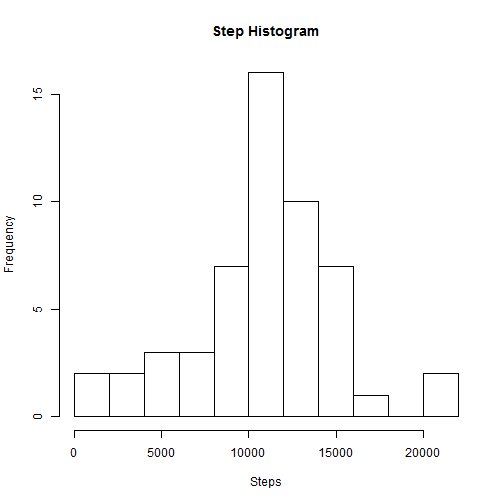
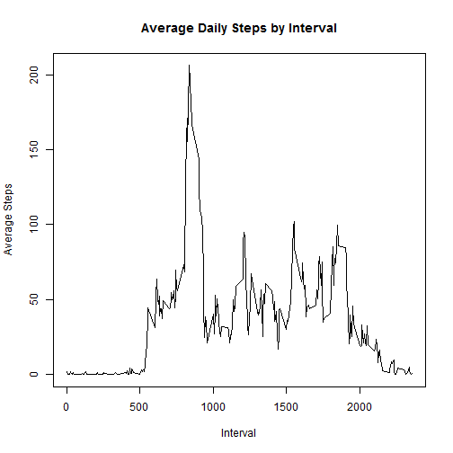
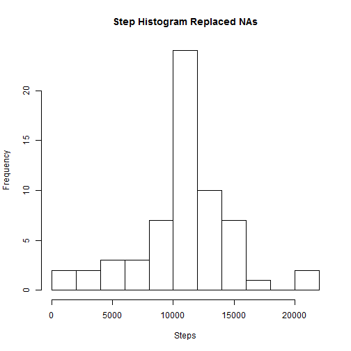
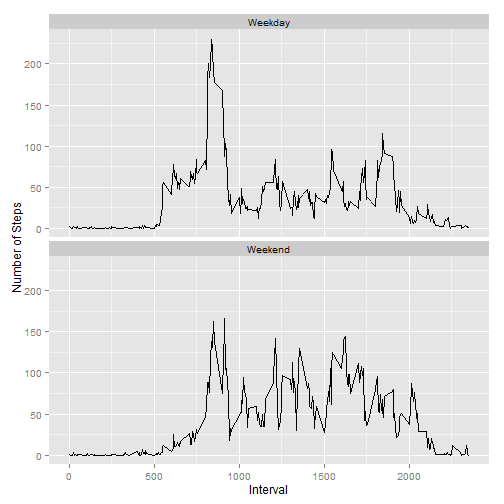

Rmarkdown file for Reproducible Research Project 1

Load and Process the Data


```r
setwd("~/R/DataScience/RepResearch")
library(RCurl)
```

```
## Loading required package: bitops
```

```r
library(knitr)
dataURL <- "https://d396qusza40orc.cloudfront.net/repdata%2Fdata%2Factivity.zip"
download.file(dataURL, destfile ="activity.zip", method="curl")
```

```
## Warning: running command 'curl "https://d396qusza40orc.cloudfront.net/
## repdata%2Fdata%2Factivity.zip" -o "activity.zip"' had status 127
```

```
## Warning in download.file(dataURL, destfile = "activity.zip", method =
## "curl"): download had nonzero exit status
```

```r
unzip("activity.zip")
activity <- read.csv("activity.csv", header = TRUE)
head(activity)
```

```
##   steps       date interval
## 1    NA 2012-10-01        0
## 2    NA 2012-10-01        5
## 3    NA 2012-10-01       10
## 4    NA 2012-10-01       15
## 5    NA 2012-10-01       20
## 6    NA 2012-10-01       25
```

```r
str(activity)
```

```
## 'data.frame':	17568 obs. of  3 variables:
##  $ steps   : int  NA NA NA NA NA NA NA NA NA NA ...
##  $ date    : Factor w/ 61 levels "2012-10-01","2012-10-02",..: 1 1 1 1 1 1 1 1 1 1 ...
##  $ interval: int  0 5 10 15 20 25 30 35 40 45 ...
```

```r
#Convert the Date field to Date format
activity$date <- as.Date(as.character(activity$date), "%Y-%m-%d")
```

What is mean total number of activity taken per day?


```r
dailySteps <- aggregate(steps ~ date, data= activity, sum)
hist(dailySteps$steps, xlab = "Steps", ylab= "Frequency", main = "Step Histogram", breaks = 10)
```

 

```r
stepMean <- mean(dailySteps$steps, na.rm=TRUE)
stepMean
```

```
## [1] 10766.19
```

```r
stepMedian<- median(dailySteps$steps, na.rm=TRUE)
stepMedian
```

```
## [1] 10765
```

Mean is 1.0766189 &times; 10<sup>4</sup> and the Median is 10765.

Average Daily Activity pattern

```r
intervalSteps <- aggregate(steps ~ interval, data = activity, mean)
plot(intervalSteps$interval,intervalSteps$steps,type="l", xlab= "Interval", ylab = "Average Steps", main= "Average Daily Steps by Interval")
```

 

```r
intervalSteps[which.max(intervalSteps$steps),]
```

```
##     interval    steps
## 104      835 206.1698
```

```r
maxInterval <- intervalSteps[which.max(intervalSteps$steps),"interval"]
```
The 5 minute maximum interval is 835.

Imputing missing values

```r
blankRows <- sum(is.na(activity$steps))
blankRows
```

```
## [1] 2304
```

```r
#substitute na's for mean from 5 minutes interval
activityWMeans <- activity
for (i in 1:nrow(activityWMeans)) {
  if (is.na(activityWMeans$steps[i])) {
    interval_value <- activityWMeans$interval[i]
    steps_value <- intervalSteps[
      intervalSteps$interval == interval_value,]
    activityWMeans$steps[i] <- steps_value$steps
  }
}
dailySteps2 <- aggregate(steps ~ date, data= activityWMeans, sum)
hist(dailySteps2$steps, xlab = "Steps", ylab= "Frequency", main = "Step Histogram Replaced NAs", breaks = 10)
```

 

```r
stepMean2 <- mean(dailySteps2$steps, na.rm=TRUE)
stepMean2
```

```
## [1] 10766.19
```

```r
stepMedian2<- median(dailySteps2$steps, na.rm=TRUE)
stepMedian2
```

```
## [1] 10766.19
```
There are 2304 rows with NA.
The mean stayed the same, 1.0766189 &times; 10<sup>4</sup> and 1.0766189 &times; 10<sup>4</sup>, but the median increased slightly 10765 and 1.0766189 &times; 10<sup>4</sup>.

Differences in activity patterns between weekdays and weekends.

```r
install.packages("ggplot2", repos = "http://cran.us.r-project.org")
```

```
## package 'ggplot2' successfully unpacked and MD5 sums checked
## 
## The downloaded binary packages are in
## 	C:\Users\Alexander_Kaplan\AppData\Local\Temp\RtmpstMysd\downloaded_packages
```

```r
library(ggplot2)
```

```
## Warning: package 'ggplot2' was built under R version 3.2.2
```

```r
?weekdays()
weekdays(activityWMeans$date[2000])
```

```
## [1] "Sunday"
```

```r
weekdays(activityWMeans$date[2000])%in% c("Sunday","Saturday")
```

```
## [1] TRUE
```

```r
activityWMeans$day <- weekdays(activityWMeans$date)
activityWMeans$type<- ifelse (activityWMeans$day %in% c('Sunday','Saturday'), 
       "Weekend", "Weekday")
activityWMeans$type <- as.factor(activityWMeans$type)
weekendSteps <- aggregate(steps ~ interval+type, data= activityWMeans, mean)
qplot(interval, steps, data=weekendSteps, type ='l', geom=c("line"), xlab= "Interval", ylab= "Number of Steps")+facet_wrap(~type, ncol=1)
```

 

